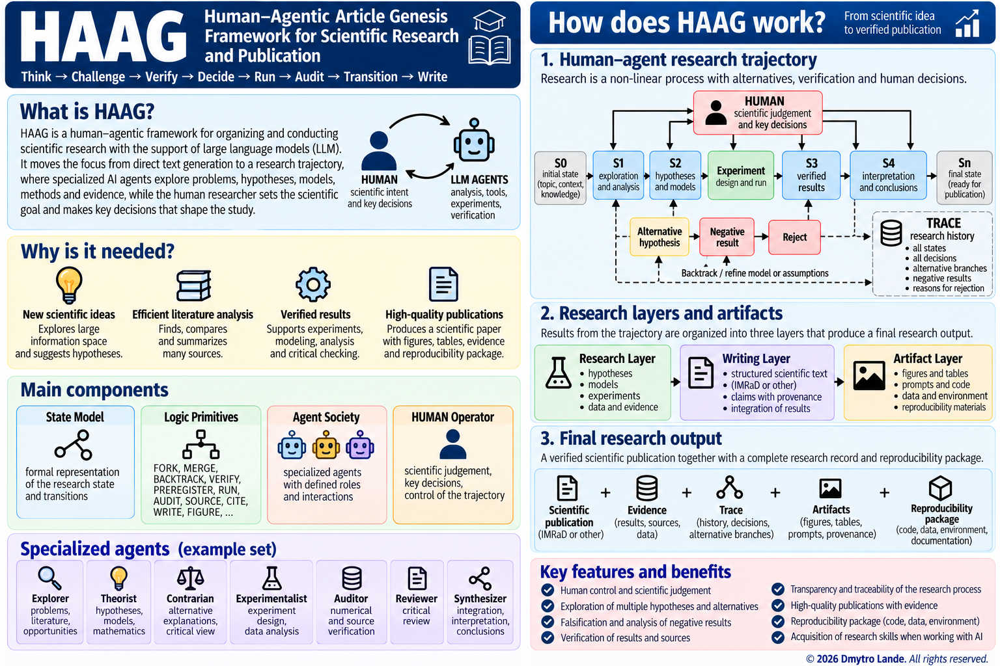
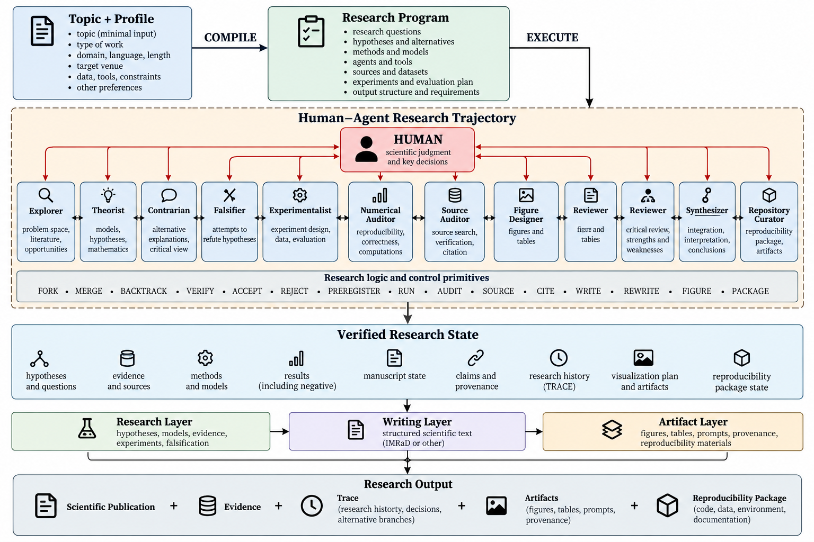
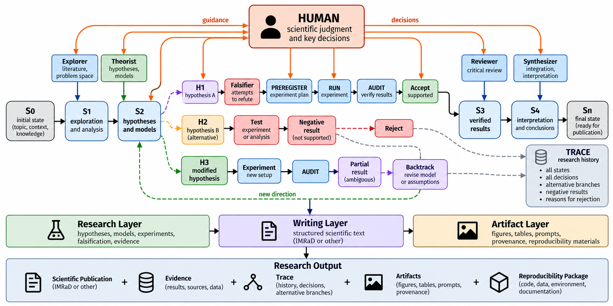

# HAAG — Human-Agentic Article Genesis

<p align="center">
  
</p>

**HAAG (Human-Agentic Article Genesis)** is a human-agentic, prompt-native, no-code framework for organizing scientific research and producing scientific publications. Its central object is not the generated text, but the **research trajectory**: a traceable sequence of hypotheses, alternatives, experiments, verification steps, human decisions, results, and research artifacts.

> **Core principle:** *Agents explore the research space; the human shapes the research trajectory.*

HAAG is designed to move the use of large language models from **“generate a paper on a topic”** toward **“conduct a structured, verifiable, human-controlled research process and then write the paper from its results.”**

---

## Quick Start with ChatGPT

The simplest way to use HAAG does not require programming.

1. Download the HAAG framework file from this repository.
2. Open a new conversation in ChatGPT.
3. Upload the framework using the **“+”** button.
4. Define your research topic — this can be as short as one sentence.
5. Ask ChatGPT to **run HAAG for this topic**.
6. Continue the research interactively with the LLM-agent system.

A minimal start can therefore be:

```text
TOPIC:
<your research topic>

Run HAAG.
```

That is enough to begin. Additional information — publication type, domain, language, target venue, available data, constraints, expected figures, or repository requirements — can be added when needed.

HAAG is intended to keep routine operations inside the agent workflow while involving the researcher when a decision can materially change the scientific trajectory.

---

## From Topic to Research Output

The framework separates two stages:

```text
HAAG Framework + Topic + Profile
                │
             COMPILE
                ↓
        Research Program
                │
             EXECUTE
                ↓
   Human–Agent Research Trajectory
                ↓
        Verified Research State
                ↓
 Scientific Publication
 + Evidence
 + Trace
 + Artifacts
 + Reproducibility Package
```

The **Research Program** may contain research questions, hypotheses and alternatives, methods and models, agents and tools, sources and datasets, experiments, evaluation criteria, and expected output structure.

<p align="center">
  
</p>

**Figure 1. Conceptual architecture of the HAAG human-agentic framework.**

---

## Specialized Research Agents

HAAG decomposes research work into specialized functions rather than asking one LLM to simultaneously behave as author, reviewer, theorist, experimentalist, and verifier.

Typical roles include **Explorer**, **Theorist**, **Contrarian**, **Falsifier**, **Experimentalist**, **Numerical Auditor**, **Source Auditor**, **Figure Designer**, **Reviewer**, **Synthesizer**, **Repository Curator**, and **Research Orchestrator**.

This specialization deliberately introduces scientific tension into the workflow. A theorist may formulate a model; a falsifier attempts to refute it; a contrarian develops an alternative explanation; an experimentalist designs a test; auditors check numerical results and sources; a reviewer searches for weaknesses; and a synthesizer integrates only sufficiently supported results.

A typical reasoning cycle is:

```text
Idea
 → Hypothesis
 → Counterhypothesis
 → Falsification
 → Experiment
 → Audit
 → Interpretation
```

The purpose is not to generate many versions of the same text. It is to create a controlled internal scientific discussion.

---

## HUMAN Is a Research Operator

The researcher is not another agent in HAAG.

**HUMAN** is a first-class operator used when a transition can substantially change the research direction. Human judgment may be requested when selecting between competing hypotheses, changing a mathematical model, choosing real or synthetic data, modifying an experiment after seeing results, redefining a metric, interpreting ambiguous findings, or making a strong novelty claim.

The researcher can accept, reject, modify, combine, narrow, expand, return to an earlier state, create a new branch, or terminate an unproductive branch.

In compact form:

```text
Agents → explore alternatives, test, criticize, verify
Human  → determines scientifically meaningful transitions
```

HAAG therefore implements a **human-in-the-research-trajectory** approach rather than merely placing a human at the final approval stage.

---

## Research Is a Branching Process

Scientific research is rarely linear. HAAG represents it as a trajectory through a space of research states, with operations such as:

`FORK` · `MERGE` · `BACKTRACK` · `VERIFY` · `ACCEPT` · `REJECT` · `SOURCE` · `CITE` · `PREREGISTER` · `FREEZE` · `RUN` · `AUDIT` · `WRITE` · `REWRITE` · `FIGURE` · `PACKAGE`

Alternative hypotheses and failed experiments are not silently deleted. They remain part of the **TRACE**, preserving why a direction was accepted, rejected, modified, or revisited.

<p align="center">
  
</p>

**Figure 2. Human-agent research trajectory in the HAAG state space.**

---

## Experiments, Audit, and Negative Results

For significant computational experiments, HAAG uses the cycle:

```text
PREREGISTER → FREEZE → RUN → AUDIT
```

Before execution, the framework can fix the hypothesis, model version, initial state, parameters, controls, metrics, stopping conditions, thresholds, random seed, and failure criteria. After `RUN` begins, these should not be changed merely to obtain a preferred outcome.

HAAG explicitly treats negative and null findings as legitimate research results:

```text
Negative Results ∈ Results
Null Results     ∈ Results
```

A failed or negative experiment is therefore not an instruction to keep modifying the model until a positive result appears. It is part of the research record.

---

## Claims and Provenance

HAAG associates important scientific claims with their support. A claim may be grounded in an equation, experiment, source, dataset, numerical result, or explicit human decision.

The central rule is simple:

> **A final scientific statement must not be stronger than its strongest verified support.**

This extends ordinary source traceability toward **traceability of the scientific argument**:

```text
Claim → Evidence / Source / Experiment / Derivation / Decision → Provenance
```

---

## Research, Writing, and Artifacts

HAAG separates three connected layers:

```text
Research Layer → Writing Layer → Artifact Layer
```

The **Research Layer** contains hypotheses, models, evidence, experiments, falsification, and interpretation.

The **Writing Layer** transforms the accepted research state into a structured scientific manuscript, using IMRaD or another appropriate publication structure.

The **Artifact Layer** contains figures, tables, prompts, provenance information, code or computational specifications, data descriptions, and reproducibility materials.

The direction matters:

```text
Research → Writing
```

The need to fill a section of a manuscript must not force the creation of a result that the research did not actually produce.

---

## Research Output

HAAG treats the scientific paper as one component of a broader result:

```text
Research Output
    =
Scientific Publication
    +
Evidence
    +
Trace
    +
Artifacts
    +
Reproducibility Package
```

Depending on the project, the final package may include the publication, figure specifications and prompts, hypothesis tree, agent history, human decision trace, rejected branches, failed experiments, experiment registry, claim and source provenance, numerical audit, working scholarly-search queries, unresolved problems, future research branches, and reproducibility materials.

---

## Fundamental HAAG Rule

HAAG should not primarily ask:

> **“What text should be generated next?”**

Its primary question is:

> **“What scientifically justified research transition should occur next?”**

The extended research cycle can be summarized as:

```text
THINK
 → CHALLENGE
 → VERIFY
 → DECIDE
 → PREREGISTER (when needed)
 → RUN
 → AUDIT
 → TRANSITION
 → WRITE
 → FIGURE
 → VERIFY SOURCES
 → CITE
 → PACKAGE
 → FINAL AUDIT
```

In compact form:

```text
Topic + Profile
      ↓
Research Program
      ↓
Human–Agent Research Trajectory
      ↓
Verified Results
      ↓
Verified Scientific Publication + Reproducibility Package
```

---

## Repository Layout

A simple repository structure is sufficient:

```text
HAAG/
├── README.md
├── HAAG_Framework_v1.1.*
├── PIC/
│   ├── HAAG-anons-eng.png
│   ├── Picture1.png
│   └── Picture2.png
└── ...
```

If your filenames differ, update the three image paths in this README accordingly.

---

## Related Framework — HAAR

HAAG addresses **how a human and an LLM-agent system can organize and conduct a traceable scientific research process**. A logically related framework by the same author is **HAAR**, which addresses another side of human–AI scientific work: assessing the author's command of the scientific reasoning behind a research text.

**HAAR — A Framework for Assessing Authorial Command of Scientific Reasoning Based on Semantic Networks**

DOI: `10.2139/ssrn.7533560`

Paper: http://dx.doi.org/10.2139/ssrn.7533560

GitHub repository: https://github.com/DmytroLande/HAAR/

Together, the two frameworks can be viewed as complementary:

```text
HAAG → Human–agent research process and publication genesis
HAAR → Evidence of human command of scientific reasoning
```

---

## Author and Copyright

**Concept and framework:** Prof. Dmytro Lande

**© 2026 Dmytro Lande. All rights reserved.**

When using, adapting, or discussing HAAG in scientific work, please cite the corresponding framework publication/specification provided with this repository.
